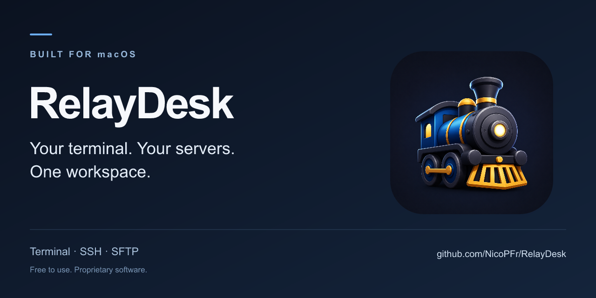

  

# RelayDesk

**A native macOS terminal and SSH client — fast, elegant, and built for a modern developer workflow.**

Unix depth. A workspace that feels at home on your Mac.

RelayDesk brings local shells, remote sessions, and file transfers together for developers and system administrators who work across several hosts every day.

**macOS-first · Local-first · Free to use · Proprietary software**

  

### [↓ Download for macOS](https://github.com/NicoPFr/RelayDesk/releases/latest/download/RelayDesk.dmg)

**RelayDesk 2.11.0** · Universal: Apple Silicon + Intel · Targets macOS 12+

[Release notes & checksum](https://github.com/NicoPFr/RelayDesk/releases/latest) · [Installation](docs/installation.md) · [Get help](#support)

> This release has an ad-hoc signature, **without Developer ID signing or notarization**. macOS may prevent it from opening. Read the [compatibility and security notes](docs/installation.md) before installing.

## Several systems. One place to work.

A local shell for your tools. An SSH session for the server. Remote files beside the command you are running. RelayDesk keeps these parts of the job in the same workspace, with tabs and splits when one terminal is no longer enough.

It is designed for sustained multi-host work: keeping related sessions together, moving between command output and files, and returning to a named workspace without rebuilding your layout from scratch.

## Inside RelayDesk

**Real application screenshots are coming next.** The image above is product branding, not a screenshot. Native captures of the workspace, split terminals, and SFTP workflow have not been published yet.

<!-- Replace this notice with the reviewed overview capture. Follow it with
split-view and SFTP images and the captions in assets/screenshots/README.md.
Embed only files that exist; never substitute mockups or browser test fixtures. -->

[Capture checklist](assets/screenshots/README.md)

## Built around the way you work

### Keep the terminal at the center

Open a local shell or connect over SSH. Search output, choose a font and theme, and arrange sessions in tabs or split views. Keep a local tool beside a remote command instead of losing the relationship between them.

### Keep remote files beside the terminal

Browse remote directories over SFTP alongside the active SSH session. Upload and download with SFTP or SCP, follow queued transfers, and open remote files in an external editor. Finder drag and drop connects that workflow with the rest of your Mac.

### Make a host list into a workspace

Group connections into folders, mark favorites, and search hosts. Name sessions and save workspaces for the environments you return to. A command palette, saved commands, and command history keep everyday actions within reach.

### Stay deliberate across multiple hosts

Shared input targets the sessions you explicitly select. Sensitive-paste review helps you inspect commands before sending them. Existing OpenSSH configuration, keys, and agents fit into the workflow rather than requiring a separate cloud account.

## From development to remote administration

- **Develop across local and remote systems.** Keep your local tools open while inspecting a remote service and its files.
- **Operate several environments.** Put related hosts side by side, organize them by workspace, and choose shared-input targets intentionally.
- **Maintain files without losing context.** Move from the terminal to SFTP, edit a remote file, and return to the same session.

## Unix tools, Mac conventions

RelayDesk keeps the depth of SSH and shell workflows while making room for familiar Mac interactions: native menus, keyboard shortcuts, system appearance, and Finder integration. The goal is less interface friction during intensive work, with the terminal always central.

The current application also includes tmux integration, SSH routing and tunnels, terminal triggers, and optional PKCS#11 authentication. Advanced tmux/TUI workflows and hardware tokens still need broader field qualification; they are not requirements for ordinary local terminal or SSH use.

## Download and install

1. [Download RelayDesk for macOS](https://github.com/NicoPFr/RelayDesk/releases/latest/download/RelayDesk.dmg).
2. Open the DMG and drag **RelayDesk** to **Applications**.
3. Open RelayDesk and follow macOS's security guidance.

The DMG contains both Apple Silicon and Intel executables and targets macOS 12 or later. The maintainer has confirmed a successful launch on macOS; every OS version and hardware combination has not been tested. The interface is currently primarily in French.

**No Developer ID signature or notarization is included.** macOS may block launch, including on managed Macs. See the [installation guide](docs/installation.md) for details and the [release notes](https://github.com/NicoPFr/RelayDesk/releases/latest) for known limitations and the SHA-256 checksum.

[Download 2.11.0 specifically](https://github.com/NicoPFr/RelayDesk/releases/download/v2.11.0/RelayDesk.dmg) · [All releases](https://github.com/NicoPFr/RelayDesk/releases)

The download button follows the latest release. GitHub's **Code → Download ZIP** contains this documentation repository, not the application. A public in-app update channel is not configured.

## Local-first, with explicit connections

Connections, preferences, history, and workspaces are stored on your Mac. Core terminal and SSH workflows do not require a RelayDesk cloud account. SSH identities and optional authentication providers are selected from your runtime environment; the distribution does not include the developer's configuration.

Local-first does not mean every action is offline. SSH and file transfers contact the hosts you select, while shells and external tools have their own network behavior. History and transcripts can contain sensitive information.

[How local data is stored](docs/privacy.md) · [First steps](docs/first-steps.md)

## Security and architecture

RelayDesk is a macOS desktop application built with Go and Wails, using the system WebKit view and an xterm.js terminal. SSH and file-transfer workflows use OpenSSH tools. The release bundles the application and required legal notices; application source code remains private.

An ad-hoc signature checks bundle integrity but does not establish an Apple-issued developer identity. Developer ID signing and notarization are planned for a later release. Keep macOS protections enabled and review security messages before proceeding.

## What comes next

- **Available:** RelayDesk 2.11.0, with local terminals, SSH, SFTP/SCP, tabs, splits, host organization, and saved workspaces.
- **Next:** real product screenshots and broader native compatibility and workflow qualification.
- **Planned:** Developer ID signing, notarization, and broader interface localization.

Follow the [release notes](https://github.com/NicoPFr/RelayDesk/releases) for shipped changes.

## Support

[Search existing issues](https://github.com/NicoPFr/RelayDesk/issues), then choose the report that fits:

[Bug report](https://github.com/NicoPFr/RelayDesk/issues/new?template=bug_report.md) · [Installation or launch problem](https://github.com/NicoPFr/RelayDesk/issues/new?template=installation_problem.md) · [Feature request](https://github.com/NicoPFr/RelayDesk/issues/new?template=feature_request.md) · [Question](https://github.com/NicoPFr/RelayDesk/issues/new?labels=question&title=Question%3A%20)

English and French are welcome. Include your RelayDesk version, macOS version, and reproduction steps. Issues are public: remove credentials, private hosts, paths, and operational output before sharing attachments.

[Browse the user documentation](docs/README.md)

## Support independent development

**RelayDesk is free to use and developed independently.** Sponsorships help support ongoing development, maintenance, bug fixes and new features. Supporting the project is optional.

GitHub Sponsors is not active yet. A verified link will be added when it becomes available.

## License and third-party notices

RelayDesk is **proprietary software**, free to use for personal and professional purposes under the [RelayDesk license](LICENSE). Redistribution, modification, and derivative works require permission except where the license or applicable law permits them. Application source code is not distributed in this repository.

Bundled components retain their own licenses. See the [third-party notices](THIRD_PARTY_NOTICES.txt).

Copyright © 2026 Nicolas Peeters. All rights reserved.
